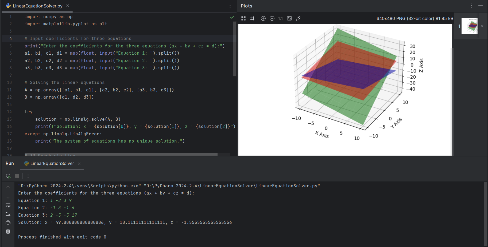

# 🎭 Linear Equation Solver & 3D Grapher 🚀

Ever been stuck solving a system of three linear equations? Manually calculating variables is a pain, right? Well, not anymore! This Python script not only solves your equations but also visualizes them in a **stunning 3D graph**. Because math should look cool too! 😎

---

## ⚡ Features
- **Solves 3 linear equations** of the form **ax + by + cz = d** in seconds.
- **Uses NumPy** for accurate calculations.
- **Plots a 3D graph** using Matplotlib, because why not?
- **Handles errors smartly**—if no unique solution exists, it tells you upfront!

---

## 🚀 Getting Started

### 1️⃣ Install Dependencies
Make sure Python is installed, then run:
```bash
pip install numpy matplotlib
```

### 2️⃣ Run the Program in PyCharm
- Open PyCharm and create a new Python file (`linear_solver.py`).
- Copy and paste the script into the file.
- Run the script directly inside PyCharm.

### 3️⃣ Input Your Equations
You'll be asked to enter the coefficients in this format:
```
Equation 1: 2 3 4 10  
Equation 2: 1 -2 3 5  
Equation 3: 3 1 -1 2  
```
_(Each row represents an equation: ax + by + cz = d)_

### 4️⃣ See the Magic ✨
- The script will solve the equations and print the solution.
- It will also generate a **3D visualization** of the equations—because we love eye candy! 🍭

---

## 📸 Screenshot
Here's how it looks in action:



---

## 🎯 Why Use This?
✔️ Because math should be **fun** 🎨  
✔️ Because Python does the **heavy lifting** 💪  
✔️ Because solving equations manually is **so last century** 🦖  

---

## 🤝 Contribute & Star ⭐
If you find this useful, **drop a star** and feel free to **contribute**! 🚀  
Made with ❤️ by **MD Dilshad Alam & Shridhar Tiwari**  
